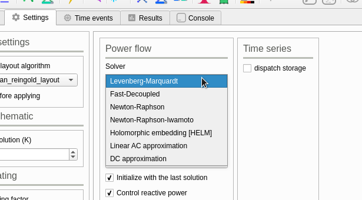

# 算法类

GridCal 内自带了多种计算分析所需的算法，包括潮流计算、最优潮流、稳定性分析、短路计算。以下通过具体分析潮流计算牛顿拉夫逊算法文件的结构，来阐述如何在 GridCal 中修改和加入算法。

## GridCal 集成的潮流算法

在运行 GridCal 后，我们可以在上方标签栏的 `Settings` 标签下的 `Power flow` 标签块下的 `Solver` 标签看到所有 GridCal 集成的适用于解决潮流计算的算法。



此处，我们选择传统的 Newton-Raphson 法来分析其代码，以了解如何在 GridCal 接入一个抽象的算法。

### 牛顿拉夫逊法(Newton-Raphson)

Newton-Raphson 法集成在了 `GridCal/Engine/Numerical/JacobianBased.py` 文件中的 `IwamotoNR` 方法中。`IwamotoNR` 方法为使用了 Iwamoto 最佳步长因子的纯牛顿拉夫逊潮流算法，使用其方法需要提供的参数如下：

| 传入参数 | 含义 |
|-----|-----| 
|Ybus|导纳矩阵|
|Sbus|节点注功率入阵列|
|V0|节点电压阵列（初始解）|
|Ibus|节点注入电流阵列|
|PV|具有PV总线索引的阵列|
|pq|包含PQ总线索引的阵列|
|tol|公差|
|max_it|最大迭代次数|
|robust|使用Iwamoto最佳步长因子的布尔变量| 

运算结束后将返回如下结果：

| 传出参数 | 含义 |
|-----|-----|
|V|电压计算结果阵列|
|converged|是否收敛，为 1 时收敛|
|normF|计算结果的误差，小于 tol 时判断为收敛|
|Scalc|不平衡功率|
|iter_|最终迭代次数|
|elapsed|完成运算的用时|

可以看到，`IwamotoNR` 方法中所需要的参数和结果得出的参数与实际电力系统分析课程中的运算内容相同，代码中具体的数学处理用到了 Python 中的数学库 `numpy`，例如矩阵运算，矩阵共轭，矩阵转置，等等。分析 `IwamotoNR` 这个方法(function)的代码，可以发现它很单纯地实现了一个牛顿拉夫逊法，而不与 GUI 以及其余的系统数据结构产生过多的联系。如果开发者想要修改这个算法的运算内容，可以在 `IwamotoNR` 方法内直接进行修改，但若要完整引入一个新的潮流算法，我们则不仅仅需要考虑算法的具体内容，还需要需要仿照 `IwamotoNR` 方法与 GridCal 的 GUI 部分产生联系。

### 潮流计算算法的二次开发


按照上图的流程，我们需要先找到潮流计算是如何触发的。

在 `GridCal/Gui/Main/GridCalMain.py` 文件中的 line 288,我们可以看到如下的代码：

```python
self.ui.actionPower_flow.triggered.connect(self.run_power_flow)
```
这句代码的表达的是，GridCal 界面上的 `actionPower_flow` 按钮被触发后，会执行 `run_power_flow` 方法。那我们可以追踪到 `run_power_flow` 来看程序是如何判断潮流算法的种类并定位执行代码的。

在 `GridCal/Gui/Main/GridCalMain.py` 文件中的 line 1543,我们可以看到 `run_power_flow` 方法的具体实现，在 line 1570，我们可以看到如下的语句：

```python
self.power_flow = PowerFlow(self.circuit, options)
self.threadpool.start(self.power_flow)
self.threadpool.waitForDone()
self.post_power_flow()
```

`threadpool` 在代码中的作用是开辟一个新的线程在后台进行潮流计算，而不妨碍用户在 GridCal 进行其它的操作。

`PowerFlow` 对象则是一个完整的潮流计算逻辑，其中传入的 `self.circuit` 参数为潮流计算时对应的电力网络，`options` 参数则为系统设置中用户选择的参数，包括了使用何种算法进行潮流计算，即在这里完成了上图流程图中第二步。

下一步，我们追踪 PowerFlow 类，定位到 `GridCal/Engine/CalculationEngine.py` line 5636 的 `run` 方法。`run` 方法的内容中再次包含了一个 `results` 变量。

```python
results = self.pf.run(store_in_island=True)
self.results = results
self.grid.power_flow_results = results
```

可以看到，真正的潮流算法还要继续定位到 `pf.run()` 方法中。截至到目前，我们可以看到 GridCal 中为了调用一个算法，需要进行多次的传参和跳转，虽然在写程序时略显繁琐，但是这非常利于后期的代码维护，以及新功能的添加。

再次定位 `pf.run()` 方法，跳转到了 `GridCal/Engine/CalculationEngine.py` line 5491。这一部分,我们可以看到潮流计算的结果实际上是由一个 `PowerFlowResults` 对象所表示的，而真正作出元算的是如下的代码：

```python
# line 5510 
res = self.run_pf(circuit, Vbus, Sbus, Ibus) 
```

定位 `run_pf()` 并跳转，我们可以到达 `GridCal/Engine/CalculationEngine.py` line 5528，看到如下的关键代码：

```python
results = self.single_power_flow(circuit=circuit,
                                solver_type=self.options.solver_type,
                                voltage_solution=Vbus,
                                Sbus=Sbus,Ibus=Ibus)

```

这里我们可以看到两个很关键的点：1. `single_power_flow()` 方法链接到最直接的潮流计算； 2.`solver_type` 参数传递了进行电网计算时的用户参数，其中我们要关注的是选用何种算法来进行计算

定位 `single_power_flow()` 可跳转到 `GridCal/Engine/CalculationEngine.py` line 5100，从这里开始，可以看到代码是如何定位算法并执行运算的。

从 line 5127 开始，程序先判断电路是否为空，为空的话就不执行计算的操作并抛出警告，若不为空，则判断用户所选的潮流计算算法，并进行计算。

```python
# line 5127
if len(circuit.power_flow_input.ref) == 0:
    voltage_solution = zeros(len(Sbus), dtype=complex)
    normF = 0
    Scalc = Sbus.copy()
    any_control_issue = False
    converged = True
    warn('Not solving power flow because there is no slack bus')
else:

```

`else:` 之后的内容则是通过 `if` 枚举的判断，可以看到之前在界面中看到的算法都出现在了这里：

```python
# line 5136
if solver_type == SolverType.HELM:
# line 5149
elif solver_type == SolverType.DC:
...
# line 5200
# Newton-Raphson
elif solver_type == SolverType.NR:
```

在 line 5200，我们可以看到了牛顿拉夫逊法是如何被代码选择并进行计算的。`SolverType` 是 GridCal 中的一个用于记录潮流计算算法种类的类，在 line 100 我们可以看到其定义的方式：

```python
# line 100
class SolverType(Enum):
    NR = 1
    NRFD_XB = 2
    NRFD_BX = 3
    ...
```

如果开发者需要加入自己的新算法，需要在这里进行注册,例如这样的格式：`NEWSOLVER = 16`。之后，转到 `GridCal/Gui/Main/GridCalMain.py` line 165 在 `solvers_dict` 字典中加入新的算法，例如这样的示例

```python
self.solvers_dict['Newton-Raphson'] = SolverType.NR
self.solvers_dict['New-Solver'] = SolverType.NEWSOLVER
```

重新运行软件后，我们可以看到新的算法被添加至菜单栏的效果：


回到 `GridCal/Engine/CalculationEngine.py` line 5200,我们可以看到如下的代码：

```python
# Solve NR with the linear AC solution
voltage_solution, converged, normF, Scalc, it, el = IwamotoNR(param...)
```

这一部分的代码即调用了 `IwamotoNR()` 方法，实现了牛顿拉夫逊法结算结果的获取。至此，我们可以总结出，根据 GridCal 的代码结构，开发者要为潮流计算加入新的算法时，需要完成如下几个步骤:

1. 在 `SolverType` 与 `solvers_dict` 中添加新的算法名称
2. `Numerical` 下建立新的算法文件，例如 `NewSolver.py`
3. 在算法文件中加入对应的方法，例如 `ns()`,其中传如传出的参数与前文的表格所列相同
4. 在 `CalculationEngine.py` 的顶部导入新的算法文件，例如 `from GridCal.Engine.Numerical.NewSOlver import ns`
5. 在 `CalculationEngine.py` 的 `single_power_flow` 方法中的枚举过程中加入新的算法，例如

```python
elif solver_type == SolverType.NewSolver:
    methods.append(SolverType.NewSolver)
    voltage_solution, converged, normF, Scalc, it, el = ns(param...)
```

至此，我们完整地梳理了如何修改现有的潮流计算算法，以及加入新的潮流计算算法至 GridCal。


## 稳定性分析

在 GridCal 的代码内，静态稳定性分析表示为 `Voltage Stability`，暂态稳定性分析表示为 `Transient Stability`。两种稳定性分析分别都只对应了一种算法，但是 GridCal 的作者依然预留了类似潮流计算时的接口，事实上，你可以看到无论是潮流计算、稳定性分析还是短路计算，它们对应的代码都有着相似的命名风格和接口规范。

在 `GridCal/Engine/CalculationEngine.py` line 6939 的 `VoltageCollapse` 类中的 `run()` 方法，我们可以找到静态稳定分析的入口。

在 `GridCal/Engine/CalculationEngine.py` line 10305 的 `TransientStability` 类中的 `run()` 方法，我们可以找到暂态稳定分析的入口。

### 连续潮流法(Continuation Power Flow)

连续潮流法是用于电网静态稳定性分析的一个重要算法，也是 GridCal 中采纳的唯一一个的静态稳定性分析的算法。

连续潮流法集成在了 `GridCal/Engine/Numerical/ContinuationPowerFlow.py` 文件的 `continuation_nr()` 方法中。相比潮流计算，它需要更多的输入参数，在此方法的注释中我们可以看到参数详细的含义。同牛顿拉夫逊法的代码实现一样，连续潮流法也需要用到 python 的若干数学库，但是从代码结构上来看，它的开发流程和牛顿拉夫逊法是一样的。

由于 GridCal 的作者未在 GUI 给静态稳定计算预留接口，所以开发者若要为稳定性分析添加新的算法，则需要比潮流计算多做一些步骤。除了要完成上述和**潮流计算一样的开发流程**，开发者还需要做以下的额外工作:

1. 在 `MainWindow.py` 中为稳定性分析添加新的 GUI Solver 菜单
2. 在 `GridCalMain.py` 中添加稳定性分析算法的字典，例如

```python
self.stb_solvers_dict = OrderedDict()
```

3. 在 `CalculationEngine.py` line 6939 的 `run()` 方法中添加类似潮流计算中对 Solver 类型判断的枚举逻辑，例如

```python
# new if judgment
if solver_type == SolverType.CPF
    ...
elif solver_type == SolverType.NEWSOLVER
    ...
```

### 动态暂态仿真(Dynamic transient simulation)

GridCal 的暂态稳定性分析的算法集成在了`GridCal/Engine/Numerical/DynamicModels.py` 文件中的 `dynamic_simulation()` 方法中，从代码结构上来说，它的开发步骤将与静态稳定性分析的算法几乎相同，若需要就现有的算法进行修改，那么只要在原生的代码上直接修改即可。需要注意的是，与静态稳定分析不同的是，GridCal 以及为暂态稳定分析的算法选项预留了 GUI 的接口，这就**不再需要**进行以下的步骤：

1. 在 `MainWindow.py` 中为稳定性分析添加新的 GUI Solver 菜单


## 短路计算

GridCal 的短路计算需要分三步走，在 `GridCal/Engine/CalculationEngine.py` line 5881 我们可以找到其位于 `ShortCircuit` 类中的入口的方法 `single_short_circuit()`。下方的代码执行了完整流程的短路计算：

```python
# line 5893
# Compute the short circuit
V, SCpower = short_circuit_3p(...)

# Compute the branches power
Sbranch, Ibranch, loading, losses =  self.compute_branch_results(circuit=circuit, V=V)

# voltage, Sbranch, loading, losses, error, converged, Qpv
results = ShortCircuitResults(...)
```

`short_circuit_3p()` 方法集成在了 `GridCal/Engine/Numerical/SC.py` 中。

`compute_branch_results()` 方法集成了 `CalculationEngine.py` 中的 line 5917。

`ShortCircuitResults()` 方法集成在了 `CalculationEngine.py` 的 line 5677。

开发者可以尝试在 `short_circuit_3p()` 方法的基础上进行二次开发。若要加入新的算法，可按照静态稳定的开发步骤来进行开发。